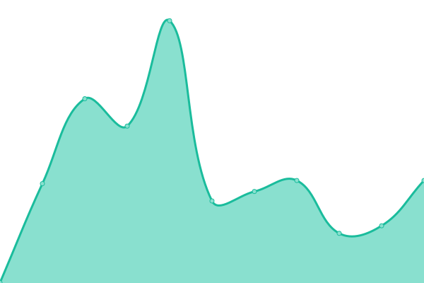
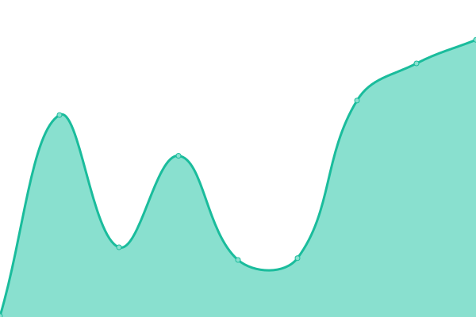
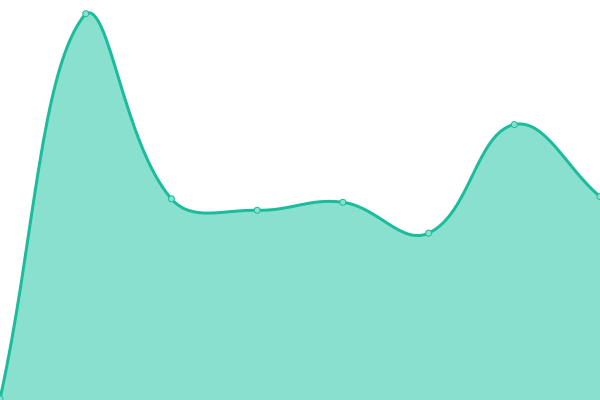
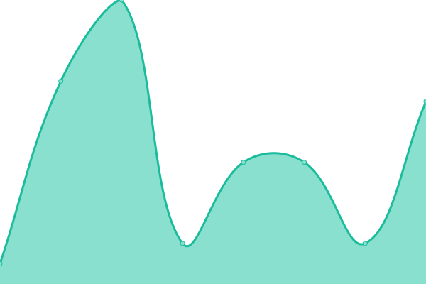
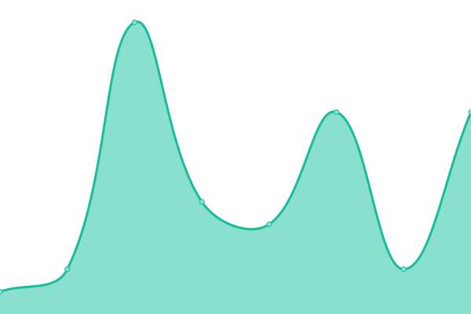
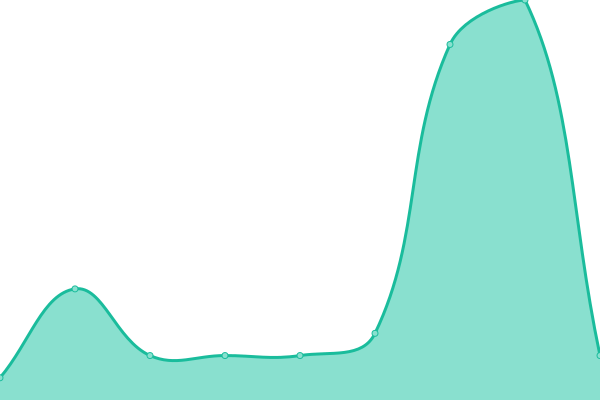
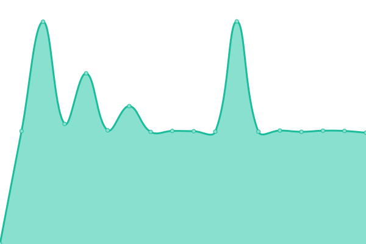
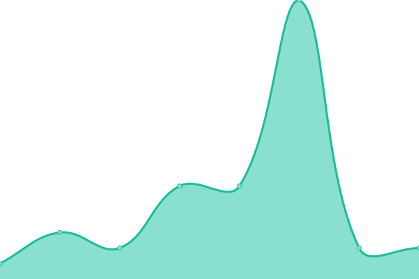

# [📈 Live Status](https://demo.upptime.js.org): <!--live status--> **🟧 Partial outage**

This repository contains the open-source uptime monitor and status page for [Upptime](https://upptime.js.org), powered by [Upptime](https://github.com/upptime/upptime).

With [Upptime](https://upptime.js.org), you can get your own unlimited and free uptime monitor and status page, powered entirely by a GitHub repository. We use [Issues](https://github.com/upptime/upptime/issues) as incident reports, [Actions](https://github.com/rifzkiadiyaksa/upptime/actions) as uptime monitors, and [Pages](https://demo.upptime.js.org) for the status page.

<!--start: status pages-->
<!-- This summary is generated by Upptime (https://github.com/upptime/upptime) -->
<!-- Do not edit this manually, your changes will be overwritten -->
<!-- prettier-ignore -->
| URL | Status | History | Response Time | Uptime |
| --- | ------ | ------- | ------------- | ------ |
|  [🔵 Rifzki Adiyaksa](https://rifzki.my.id) | 🟥 Down | [rifzki-adiyaksa.yml](https://github.com/rifzkiadiyaksa/upptime/commits/HEAD/history/rifzki-adiyaksa.yml) | 

 756ms
     
 | 

<a href="https://status.rifzki.my.id/history/rifzki-adiyaksa">0.00%</a>
    

|  [🔵 Blog Rifzki Adiyaksa](https://rifzkia.blogspot.com) | 🟩 Up | [blog-rifzki-adiyaksa.yml](https://github.com/rifzkiadiyaksa/upptime/commits/HEAD/history/blog-rifzki-adiyaksa.yml) | 

 588ms
     
 | 

<a href="https://status.rifzki.my.id/history/blog-rifzki-adiyaksa">100.00%</a>
    

|  [🔵 Games Rifzki Adiyaksa](https://google.com) | 🟩 Up | [games-rifzki-adiyaksa.yml](https://github.com/rifzkiadiyaksa/upptime/commits/HEAD/history/games-rifzki-adiyaksa.yml) | 

 206ms
     
 | 

<a href="https://status.rifzki.my.id/history/games-rifzki-adiyaksa">100.00%</a>
    

|  [🔵 Music Rifzki Adiyaksa](https://google.com) | 🟩 Up | [music-rifzki-adiyaksa.yml](https://github.com/rifzkiadiyaksa/upptime/commits/HEAD/history/music-rifzki-adiyaksa.yml) | 

 85ms
     
 | 

<a href="https://status.rifzki.my.id/history/music-rifzki-adiyaksa">100.00%</a>
    

|  [Canada Server](1.1.1.1) | 🟩 Up | [canada-server.yml](https://github.com/rifzkiadiyaksa/upptime/commits/HEAD/history/canada-server.yml) | 

 6ms
     
 | 

<a href="https://status.rifzki.my.id/history/canada-server">100.00%</a>
    

|  [Jakarta Server](8.8.8.8) | 🟩 Up | [jakarta-server.yml](https://github.com/rifzkiadiyaksa/upptime/commits/HEAD/history/jakarta-server.yml) | 

 5ms
     
 | 

<a href="https://status.rifzki.my.id/history/jakarta-server">100.00%</a>
    

|  [Singapore Server](103.20.184.82) | 🟩 Up | [singapore-server.yml](https://github.com/rifzkiadiyaksa/upptime/commits/HEAD/history/singapore-server.yml) | 

 211ms
     
 | 

<a href="https://status.rifzki.my.id/history/singapore-server">99.38%</a>
    

|  [Osaka Server](36.89.125.12) | 🟩 Up | [osaka-server.yml](https://github.com/rifzkiadiyaksa/upptime/commits/HEAD/history/osaka-server.yml) | 

 243ms
     
 | 

<a href="https://status.rifzki.my.id/history/osaka-server">100.00%</a>
    

|  [Kuala Lumpur Server](103.110.8.142) | 🟩 Up | [kuala-lumpur-server.yml](https://github.com/rifzkiadiyaksa/upptime/commits/HEAD/history/kuala-lumpur-server.yml) | 

 225ms
     
 | 

<a href="https://status.rifzki.my.id/history/kuala-lumpur-server">100.00%</a>
    

|  [Karawang Server](114.141.52.234) | 🟩 Up | [karawang-server.yml](https://github.com/rifzkiadiyaksa/upptime/commits/HEAD/history/karawang-server.yml) | 

 222ms
     
 | 

<a href="https://status.rifzki.my.id/history/karawang-server">100.00%</a>
    

|  [Mumbai Server](103.168.119.181) | 🟥 Down | [mumbai-server.yml](https://github.com/rifzkiadiyaksa/upptime/commits/HEAD/history/mumbai-server.yml) | 

 966ms
     
 | 

<a href="https://status.rifzki.my.id/history/mumbai-server">61.33%</a>
    

|  [Hongkong Server](103.214.54.206) | 🟩 Up | [hongkong-server.yml](https://github.com/rifzkiadiyaksa/upptime/commits/HEAD/history/hongkong-server.yml) | 

 233ms
     
 | 

<a href="https://status.rifzki.my.id/history/hongkong-server">98.08%</a>
    

|  [Seoul Server](119.110.71.221) | 🟩 Up | [seoul-server.yml](https://github.com/rifzkiadiyaksa/upptime/commits/HEAD/history/seoul-server.yml) | 

 226ms
     
 | 

<a href="https://status.rifzki.my.id/history/seoul-server">100.00%</a>
    

|  [CDN Asia Server](121.100.25.249) | 🟩 Up | [cdn-asia-server.yml](https://github.com/rifzkiadiyaksa/upptime/commits/HEAD/history/cdn-asia-server.yml) | 

 231ms
     
 | 

<a href="https://status.rifzki.my.id/history/cdn-asia-server">100.00%</a>
    

|  [CDN US Server](103.106.219.62) | 🟩 Up | [cdn-us-server.yml](https://github.com/rifzkiadiyaksa/upptime/commits/HEAD/history/cdn-us-server.yml) | 

 245ms
     
 | 

<a href="https://status.rifzki.my.id/history/cdn-us-server">96.39%</a>
    

|  [CDN EU Server](103.126.201.1) | 🟩 Up | [cdn-eu-server.yml](https://github.com/rifzkiadiyaksa/upptime/commits/HEAD/history/cdn-eu-server.yml) | 

 253ms
     
 | 

<a href="https://status.rifzki.my.id/history/cdn-eu-server">100.00%</a>
    

<!--end: status pages-->

[**Visit our status website →**](https://demo.upptime.js.org)

## 📄 License

- Powered by: [Upptime](https://github.com/upptime/upptime)
- Code: [MIT](./LICENSE) © [Upptime](https://upptime.js.org)
- Data in the `./history` directory: [Open Database License](https://opendatacommons.org/licenses/odbl/1-0/)
