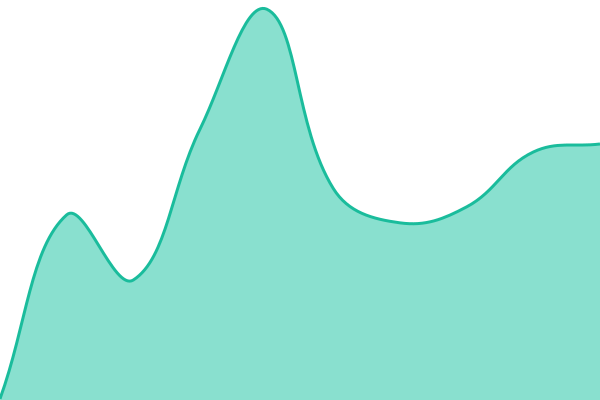
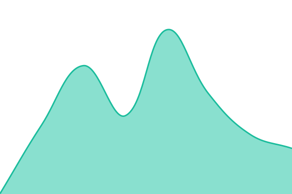
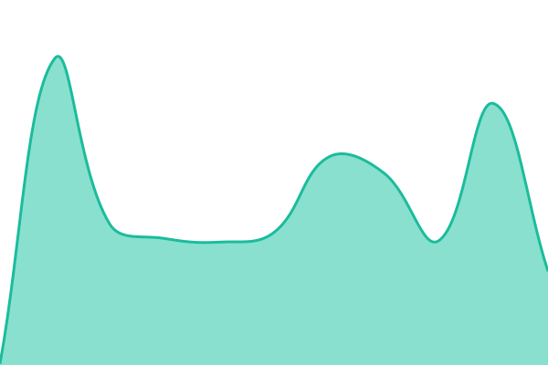
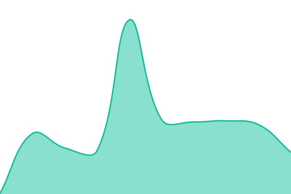
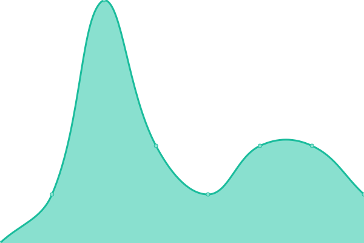
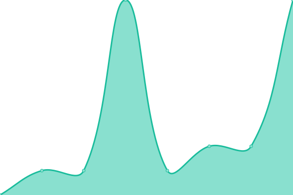
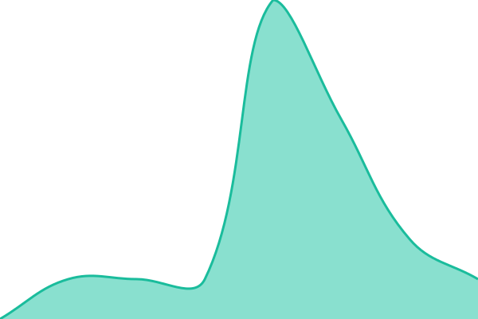

# [📈 Live Status](https://demo.upptime.js.org): <!--live status--> **🟧 Partial outage**

This repository contains the open-source uptime monitor and status page for [Upptime](https://upptime.js.org), powered by [Upptime](https://github.com/upptime/upptime).

With [Upptime](https://upptime.js.org), you can get your own unlimited and free uptime monitor and status page, powered entirely by a GitHub repository. We use [Issues](https://github.com/upptime/upptime/issues) as incident reports, [Actions](https://github.com/rifzkiadiyaksa/upptime/actions) as uptime monitors, and [Pages](https://demo.upptime.js.org) for the status page.

<!--start: status pages-->
<!-- This summary is generated by Upptime (https://github.com/upptime/upptime) -->
<!-- Do not edit this manually, your changes will be overwritten -->
<!-- prettier-ignore -->
| URL | Status | History | Response Time | Uptime |
| --- | ------ | ------- | ------------- | ------ |
|  [🔵 Rifzki Adiyaksa](https://rifzki.my.id) | 🟥 Down | [rifzki-adiyaksa.yml](https://github.com/rifzkiadiyaksa/upptime/commits/HEAD/history/rifzki-adiyaksa.yml) | 

 300ms
     
 | 

<a href="https://status.rifzki.my.id/history/rifzki-adiyaksa">0.00%</a>
    

|  [🔵 Blog Rifzki Adiyaksa](https://blog.rifzki.my.id) | 🟩 Up | [blog-rifzki-adiyaksa.yml](https://github.com/rifzkiadiyaksa/upptime/commits/HEAD/history/blog-rifzki-adiyaksa.yml) | 

 736ms
     
 | 

<a href="https://status.rifzki.my.id/history/blog-rifzki-adiyaksa">100.00%</a>
    

|  [🔵 Games Rifzki Adiyaksa](https://congklak.game.rifzki.my.id) | 🟩 Up | [games-rifzki-adiyaksa.yml](https://github.com/rifzkiadiyaksa/upptime/commits/HEAD/history/games-rifzki-adiyaksa.yml) | 

 256ms
     
 | 

<a href="https://status.rifzki.my.id/history/games-rifzki-adiyaksa">100.00%</a>
    

|  [🔵 Music Rifzki Adiyaksa](https://google.com) | 🟩 Up | [music-rifzki-adiyaksa.yml](https://github.com/rifzkiadiyaksa/upptime/commits/HEAD/history/music-rifzki-adiyaksa.yml) | 

 168ms
     
 | 

<a href="https://status.rifzki.my.id/history/music-rifzki-adiyaksa">100.00%</a>
    

|  [Primary Server](rifzki.my.id) | 🟩 Up | [primary-server.yml](https://github.com/rifzkiadiyaksa/upptime/commits/HEAD/history/primary-server.yml) | 

 6ms
     
 | 

<a href="https://status.rifzki.my.id/history/primary-server">100.00%</a>
    

|  [SG Server](rifzki.my.id) | 🟥 Down | [sg-server.yml](https://github.com/rifzkiadiyaksa/upptime/commits/HEAD/history/sg-server.yml) | 

 0ms
     
 | 

<a href="https://status.rifzki.my.id/history/sg-server">0.00%</a>
    

|  [KL Server](rifzki.my.id) | 🟥 Down | [kl-server.yml](https://github.com/rifzkiadiyaksa/upptime/commits/HEAD/history/kl-server.yml) | 

 0ms
     
 | 

<a href="https://status.rifzki.my.id/history/kl-server">0.00%</a>
    

|  [KRW Server](1.1.1.1) | 🟩 Up | [krw-server.yml](https://github.com/rifzkiadiyaksa/upptime/commits/HEAD/history/krw-server.yml) | 

 6ms
     
 | 

<a href="https://status.rifzki.my.id/history/krw-server">100.00%</a>
    

|  [AI Int-Access Server](203.160.56.18) | 🟩 Up | [ai-int-access-server.yml](https://github.com/rifzkiadiyaksa/upptime/commits/HEAD/history/ai-int-access-server.yml) | 

 222ms
     
 | 

<a href="https://status.rifzki.my.id/history/ai-int-access-server">100.00%</a>
    

|  [CDN Asia Server](1.0.0.1) | 🟩 Up | [cdn-asia-server.yml](https://github.com/rifzkiadiyaksa/upptime/commits/HEAD/history/cdn-asia-server.yml) | 

 5ms
     
 | 

<a href="https://status.rifzki.my.id/history/cdn-asia-server">100.00%</a>
    

|  [CDN US Server](103.106.219.62) | 🟩 Up | [cdn-us-server.yml](https://github.com/rifzkiadiyaksa/upptime/commits/HEAD/history/cdn-us-server.yml) | 

 286ms
     
 | 

<a href="https://status.rifzki.my.id/history/cdn-us-server">99.40%</a>
    

<!--end: status pages-->

[**Visit our status website →**](https://demo.upptime.js.org)

## 📄 License

- Powered by: [Upptime](https://github.com/upptime/upptime)
- Code: [MIT](./LICENSE) © [Upptime](https://upptime.js.org)
- Data in the `./history` directory: [Open Database License](https://opendatacommons.org/licenses/odbl/1-0/)
